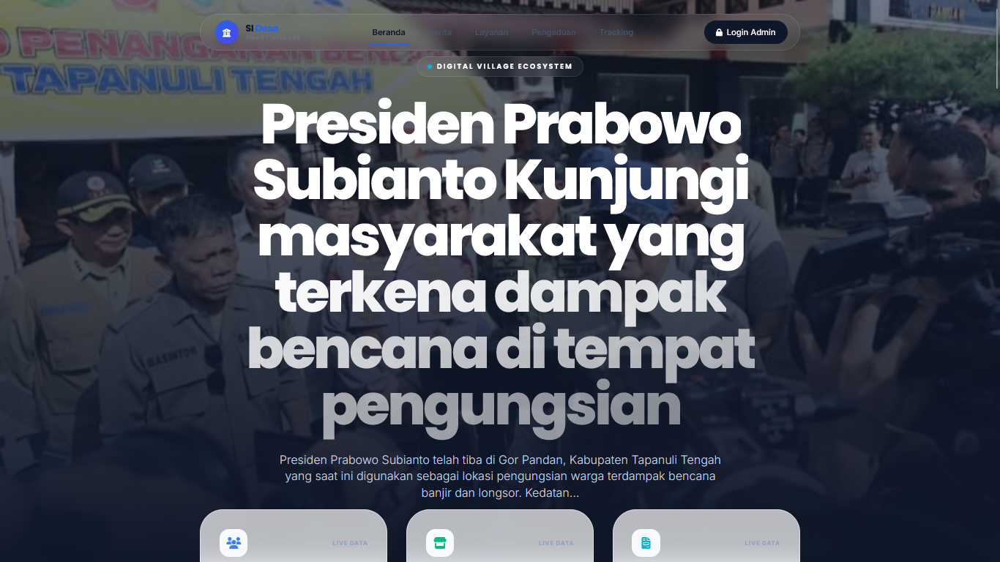

# SI Desa — Smart Village Ecosystem

Sistem Informasi Desa berbasis web untuk mendukung digitalisasi pelayanan publik dan pengelolaan informasi desa.

## Overview

SI Desa dikembangkan sebagai project Kerja Praktik pada Dinas Komunikasi dan Informatika Kabupaten Tapanuli Tengah.

Sistem menyediakan area layanan untuk warga dan dashboard administrasi untuk membantu pengelolaan layanan serta informasi desa.

## Screenshots

### Halaman Beranda



### Dashboard Admin


## Main Features

### Warga

- Beranda
- Katalog layanan
- Pengajuan permohonan layanan
- Tracking status permohonan
- Pengaduan masyarakat
- Berita desa
- Transparansi APBDes
- Informasi kependudukan
- Direktori UMKM

### Admin

- Dashboard monitoring
- Manajemen layanan
- Manajemen permohonan
- Manajemen tracking
- Manajemen pengaduan
- Manajemen APBDes
- Manajemen berita
- Manajemen penduduk
- Manajemen UMKM
- Statistik dashboard

## Tech Stack

| Layer | Technology |
| --- | --- |
| Backend | Laravel 10 |
| Language | PHP 8.2+ |
| Database | MySQL 8.x |
| Frontend | Blade / JavaScript |
| Styling | Tailwind CSS |
| Charts | Chart.js |
| Build Tool | Vite |

## Project Structure

```text
sistem-informasi-desa/
├── app/
├── bootstrap/
├── config/
├── database/
├── public/
├── resources/
├── routes/
├── screenshot/
├── storage/
└── tests/
```

## Getting Started

### 1. Clone repository

```bash
git clone https://github.com/nabilsupardy4422/sistem-informasi-desa.git
cd sistem-informasi-desa
```

### 2. Install dependencies

```bash
composer install
npm install
```

### 3. Environment

```bash
cp .env.example .env
php artisan key:generate
```

Configure the MySQL connection in `.env`.

Example:

```env
DB_DATABASE=si_desa
DB_USERNAME=root
DB_PASSWORD=
```

### 4. Database

```bash
php artisan migrate
php artisan db:seed
```

### 5. Run development server

Terminal 1:

```bash
php artisan serve
```

Terminal 2:

```bash
npm run dev
```

Application:

```text
http://127.0.0.1:8000
```

## Project Modules

```text
Public Information
       │
       ├── News
       ├── Village Information
       ├── UMKM
       └── APBDes

Public Services
       │
       ├── Service Catalog
       ├── Applications
       ├── Tracking
       └── Complaints

Administration
       │
       ├── Service Management
       ├── Application Management
       ├── Population
       ├── UMKM
       ├── APBDes
       └── Dashboard
```

## Testing

Black Box Testing digunakan untuk menguji fungsi utama sistem berdasarkan kebutuhan dan alur penggunaan.

## Author

**Nabil Adillah Supardy**

Universitas Islam Negeri Imam Bonjol Padang

## License

Project ini dikembangkan untuk keperluan akademik dan Kerja Praktik.
